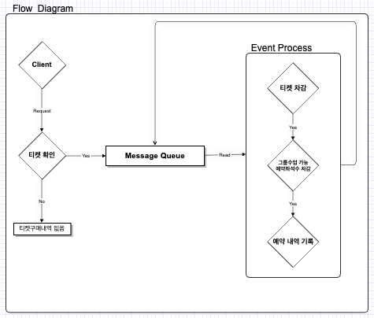
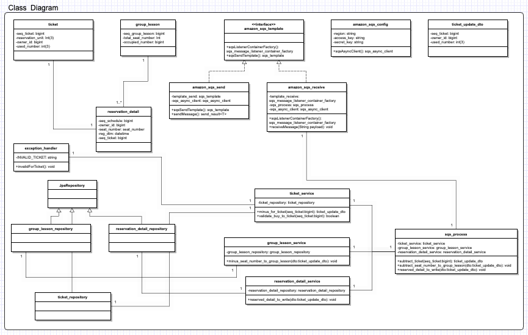

## 여기서는 아래를 설명합니다

- 동시접속 그룹수업 예약 처리 API 클래스 다이어그램

 

---
> ☑️ 4번 문항   
> 
> 클래스 다이어그램을 만들기 전 내가 생각하는 흐름을 간단히 만듬   
> 티켓은 이미 구매한 상태이고 예약 프로세스에 들어가기 전 티켓유무를 확인   
> 없는 경우 → 에러 발생 / 있는 경우 → Queue 적재   
> 큐에서 읽어오면 이벤트 프로세스 수행   
> 위 과정을 반복

 
> 하나의 티켓은 하나의 예약내역을 가질 수 있다 > (ticket) one to one (reservation_detail)   
> 하나의 그룹 레슨은 여러개 예약 내역을 가질 수 있다 > (group_lesson) one to many (reservation_detail)
> 
> aws sqs 서비스를 사용하기 위한 설정 > amazon_sqs_config   
> ticket 데이터 수정을 위한 데이터 전달 객체 > ticket_update_dto
> 
> aws sqs 스펙에서 제시하는 송신(send), 수신(receive)용 템플릿 > amazon_sqs_template
> - template 을 사용해 sqs 옵션을 원하는 대로 세팅 가능
> - 송신(send),수신(receive) 모두 구현이 필요해 상위 인터페이스로 구성
> 
> aws sqs 같은 토픽에게 송신하는 send > amazon_sqs_send   
> aws sqs 큐에 존재하다가 요청으로 들어온걸 듣는 receive > amazon_sqs_receive
> 
> 요청으로 들어온 큐 내용을 실제로 처리하는 객체 > sqs_process
> - 티켓 차감
> - 그룹수업 가능 예약좌석수 차감
> - 예약 내역 기록
>
> 위 내용이 수행된다.
> 
> 티켓 차감과 유효하지 않은 티켓을 검사하는 서비스 객체 > ticket_service & exception_handler   
> 그룹 수업 가능 예약좌석수 차감을 위한 서비스 객체 > group_lesson_service   
> 예약 내역 기록을 위한 서비스 객체 > reservation_detail_service
> 
> 나머지 클래스들은 데이터베이스에 접근해 CRUD 처리를 위해 구성

