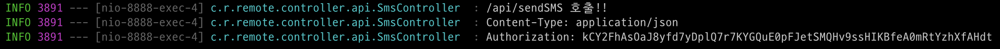
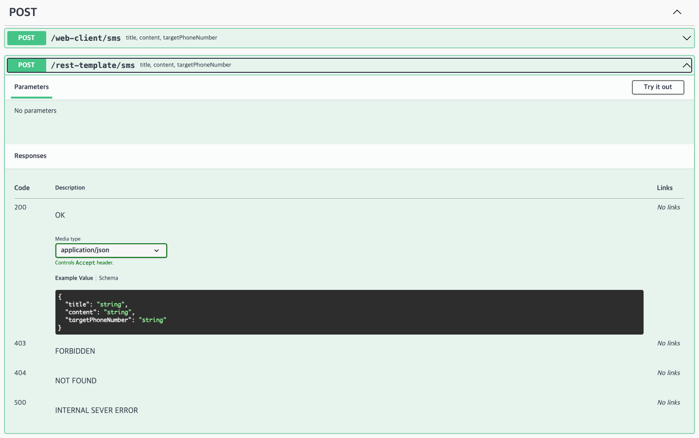
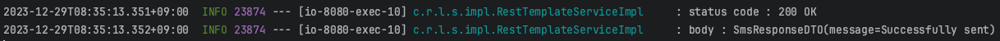

## 여기서는 아래를 설명합니다.

- 간단한 코드 흐름
- RestTemplate vs WebClient 차이

> ☑️ 5번 문항
>
> 외부 Rest API endpoint: https://test-redblue.kro.kr   
> 지원 Method, Content-Type: POST, JSON   
> HTTP Header: Bearer Token 으로 Authorization Header 추가



```java
@PostMapping(value = "/sendSMS")
public ResponseEntity<SmsResponseDTO> sendToSMS(
@RequestBody SmsRequestDTO requestDTO,
@RequestHeader(name = "Content-Type") String contentType,
@RequestHeader(name = "Authorization") String token
        ){
        LOGGER.info("/api/sendSMS 호출!!");
        LOGGER.info("Content-Type: {}",contentType);
        LOGGER.info("Authorization: {}",token);

        SmsResponseDTO responseDTO=new SmsResponseDTO();

        if(requestDTO.getTitle()==null
        ||requestDTO.getContent()==null
        ||requestDTO.getTargetPhoneNumber()==null){
        throw new CustomException(SMS_REQUEST_NOT_FOUND);
        }

        responseDTO.setMessage("Successfully sent");

        return ResponseEntity.status(HttpStatus.OK).body(responseDTO);
        }
```

> Request JSON Sample



> Response



---
> ❗️RestTemplate vs WebClient❗️
>
> Spring 에서 HTTP 요청을 처리할 때 RestTemplate를 사용했다.
> 그러나 `Spring 5`부터 WebClient가 도입되어 HTTP 요청 처리에 대한 새로운 클라이언트를 제공한다.
>
> `RestTemplate`는 동기식 HTTP 클라이언트이며 RESTful 서비스에 HTTP 요청을 할 때 Spring 개발자가 선택하는 편리한 방법이다.
>
> 장점
> - RestTemplate는 모든 HTTP 메서드에 대한 템플릿 제공
> - 다음 요청을 처리하기 위해서는 이전 요청을 완료해야 한다 (동기식)
> - Spring 프로젝트에서 많이 사용되어 커뮤니티 지원이 활발하다
>
> 단점
> - 앞으로 계획된 주요 업데이트가 없고 `Spring 5`부터 Deprecated
> - IO 또는 네트워크 호출이 많은 애플리케이션 리소스를 비효율적으로 사용할 수 있음
>
> `WebClient`는 Spring WebFlux 모듈의 일부로 `Spring 5`에 도입되고 `publisher-subscriber` 모델에서 작동하며 기존 서블릿 기반 환경과 `non-blocking`환경을
> 모두 지원한다.
>
> 장점
> - `non-blocking`을 지원해 많은 동시 연결을 처리하고 부하가 높은 애플리케이션에 적합
> - 기존 서블릿 기반 환경과 반응형 환경에서 동작 지원
>
> 단점
> - 반응형 프로그래밍에 익숙해야하고 비동기식 동작에 대한 패러다임을 이해 해야함
>

```
// maven repo web MVC
implementation 'org.springframework.boot:spring-boot-starter-web'
// maven repo webflux
implementation 'org.springframework.boot:spring-boot-starter-webflux'
```

> Gradle 의존도 다르다.   
> WebClient는 webflux를 기반으로 하고 RestTemplate는 web mvc를 기반한다.

---
> ☑️ Error Exceptions  
> @ControllerAdvice: 프로젝트 전역에서 발생하는 모든 예외 잡기   
> @ExceptionHandler: 발생한 특정 예외 잡아 하나의 메서드로 공통 처리

```java

@RestControllerAdvice
public class GlobalExceptionHandler extends ResponseEntityExceptionHandler {
    private final Logger LOGGER = LoggerFactory.getLogger(GlobalExceptionHandler.class);

    @ExceptionHandler(value = {CustomException.class})
    protected ResponseEntity<ErrorResponse> handleCustomException(CustomException e) {
        LOGGER.info("handleCustomException throw CustomException: {}", e.getErrorCode());
        return ErrorResponse.toResponseEntity(e.getErrorCode());
    }
}

@Getter
@AllArgsConstructor
public enum ErrorCode {
    /* 403 Forbidden: 콘텐츠 접근할 권리 없음 */
    // TODO: 401과 다른 점은 서버는 클라이언트가 누구인지 알고 있다
    INVALID_BEARER_TOKEN(FORBIDDEN, "권한 정보가 없는 토큰입니다."),

    /* 404 Not Found: 요청 리소스 찾을 수 없음 */
    SMS_REQUEST_NOT_FOUND(NOT_FOUND, "요청 데이터를 찾을 수 없습니다."),

    /* 500 Internal Server Error: 서버 처리 문제 */
    SERVER_ERROR(INTERNAL_SERVER_ERROR, "서버 처리에 문제가 발생했습니다.");

    private final HttpStatus httpStatus;
    private final String detail;
}
```