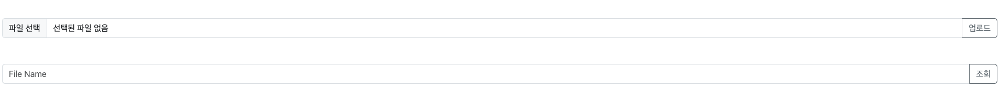
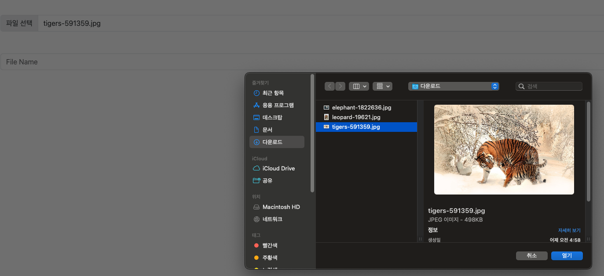
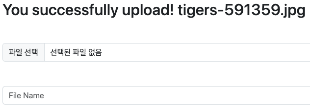
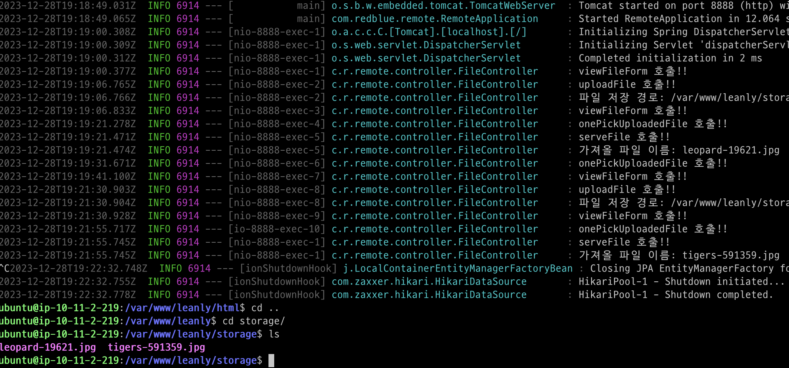
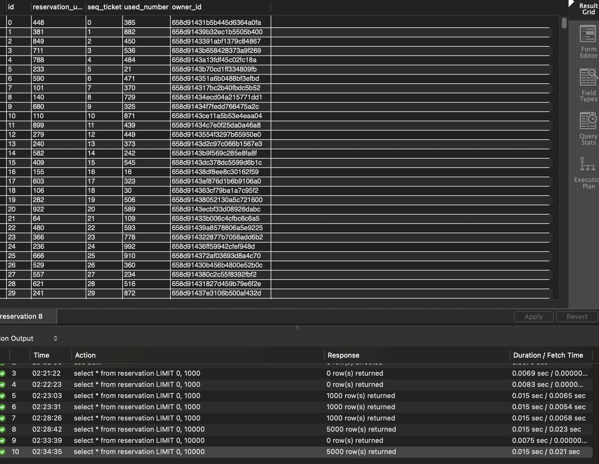
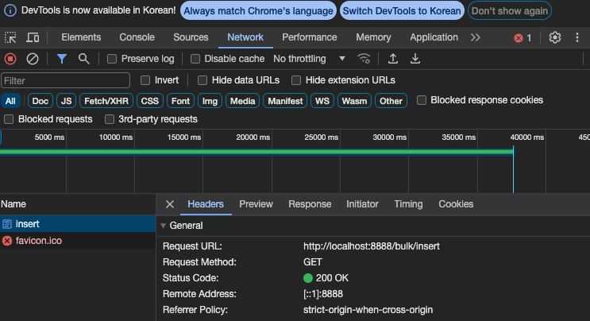
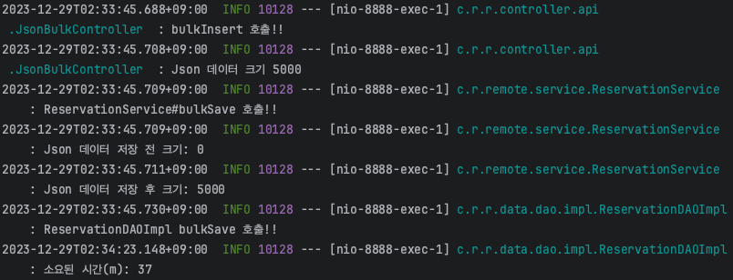

## 여기서는 아래를 설명합니다

- Java + Spring Boot 구조로, Post Multipart 파일 업로드 및 파일명 조회 API
- HashMap 이용 String 글자 수 카운트 Method 및 테스트코드
- Json 으로 전달받은 입력값 500건마다 bulk insert

<br/>

---
> ☑️ 프로젝트 디렉토리 구성

```
 ┣ 📂jsonbulk
 ┃ ┗ 📜generated.json
 ┣ 📂src
 ┃ ┣ 📂main
 ┃ ┃ ┣ 📂java
 ┃ ┃ ┃ ┗ 📂com
 ┃ ┃ ┃ ┃ ┗ 📂redblue
 ┃ ┃ ┃ ┃ ┃ ┗ 📂remote
 ┃ ┃ ┃ ┃ ┃ ┃ ┣ 📂config
 ┃ ┃ ┃ ┃ ┃ ┃ ┃ ┗ 📜StorageProperties.java
 ┃ ┃ ┃ ┃ ┃ ┃ ┣ 📂controller
 ┃ ┃ ┃ ┃ ┃ ┃ ┃ ┣ 📂api
 ┃ ┃ ┃ ┃ ┃ ┃ ┃ ┃ ┣ 📜JsonBulkController.java
 ┃ ┃ ┃ ┃ ┃ ┃ ┃ ┃ ┗ 📜SmsController.java
 ┃ ┃ ┃ ┃ ┃ ┃ ┃ ┗ 📜FileController.java
 ┃ ┃ ┃ ┃ ┃ ┃ ┣ 📂data
 ┃ ┃ ┃ ┃ ┃ ┃ ┃ ┣ 📂dao
 ┃ ┃ ┃ ┃ ┃ ┃ ┃ ┃ ┣ 📂impl
 ┃ ┃ ┃ ┃ ┃ ┃ ┃ ┃ ┃ ┗ 📜ReservationDAOImpl.java
 ┃ ┃ ┃ ┃ ┃ ┃ ┃ ┃ ┗ 📜ReservationDAO.java
 ┃ ┃ ┃ ┃ ┃ ┃ ┃ ┣ 📂dto
 ┃ ┃ ┃ ┃ ┃ ┃ ┃ ┃ ┣ 📜FileLoadOneDTO.java
 ┃ ┃ ┃ ┃ ┃ ┃ ┃ ┃ ┣ 📜FileUploadDTO.java
 ┃ ┃ ┃ ┃ ┃ ┃ ┃ ┃ ┣ 📜ReservationBulkDTO.java
 ┃ ┃ ┃ ┃ ┃ ┃ ┃ ┃ ┣ 📜SmsRequestDTO.java
 ┃ ┃ ┃ ┃ ┃ ┃ ┃ ┃ ┗ 📜SmsResponseDTO.java
 ┃ ┃ ┃ ┃ ┃ ┃ ┃ ┣ 📂entity
 ┃ ┃ ┃ ┃ ┃ ┃ ┃ ┃ ┗ 📜ReservationEntity.java
 ┃ ┃ ┃ ┃ ┃ ┃ ┣ 📂exception
 ┃ ┃ ┃ ┃ ┃ ┃ ┃ ┣ 📜CustomException.java
 ┃ ┃ ┃ ┃ ┃ ┃ ┃ ┣ 📜ErrorCode.java
 ┃ ┃ ┃ ┃ ┃ ┃ ┃ ┣ 📜ErrorResponse.java
 ┃ ┃ ┃ ┃ ┃ ┃ ┃ ┗ 📜GlobalExceptionHandler.java
 ┃ ┃ ┃ ┃ ┃ ┃ ┣ 📂repository
 ┃ ┃ ┃ ┃ ┃ ┃ ┃ ┗ 📜ReservationRepository.java
 ┃ ┃ ┃ ┃ ┃ ┃ ┣ 📂service
 ┃ ┃ ┃ ┃ ┃ ┃ ┃ ┣ 📜FileService.java
 ┃ ┃ ┃ ┃ ┃ ┃ ┃ ┗ 📜ReservationService.java
 ┃ ┃ ┃ ┃ ┃ ┃ ┣ 📂vo
 ┃ ┃ ┃ ┃ ┃ ┃ ┃ ┗ 📜FileRecord.java
 ┃ ┃ ┃ ┃ ┃ ┃ ┣ 📂word
 ┃ ┃ ┃ ┃ ┃ ┃ ┃ ┗ 📜WordCount.java
 ┃ ┃ ┃ ┃ ┃ ┃ ┗ 📜RemoteApplication.java
 ┃ ┃ ┗ 📂resources
 ┃ ┃ ┃ ┣ 📂templates
 ┃ ┃ ┃ ┃ ┗ 📜fileForm.html
 ┃ ┃ ┃ ┗ 📜application.yml
 ┃ ┗ 📂test
 ┃ ┃ ┗ 📂java
 ┃ ┃ ┃ ┗ 📂com
 ┃ ┃ ┃ ┃ ┗ 📂redblue
 ┃ ┃ ┃ ┃ ┃ ┗ 📂remote
 ┃ ┃ ┃ ┃ ┃ ┃ ┣ 📂word
 ┃ ┃ ┃ ┃ ┃ ┃ ┃ ┗ 📜WordCountTest.java
 ┃ ┃ ┃ ┃ ┃ ┃ ┗ 📜RemoteApplicationTests.java
 ┣ 📜.gitignore
 ┣ 📜HELP.md
 ┣ 📜README.md
 ┣ 📜build.gradle
 ┣ 📜gradlew
 ┣ 📜gradlew.bat
 ┗ 📜settings.gradle
```

---
> ☑️ 1번 문항
>
> config: 서버 로컬 스토리지를 사용해 업로드 파일 저장하기 위한 루트 경로 설정
>
> controller: 파일 관련 처리를 위한 endpoint api FileController
>
> - viewFileForm(): 파일 업로드 및 조회를 위한 페이지
> - uploadFile(): 사용자가 요청한 파일 서버 로컬 스토리지 업로드
> - onePickUploadedFile(): 사용자가 요청한 파일명 조회
> - serveFile(): 조회한 파일을 페이지에 보여주기 위한 서버 로컬 스토리지 경로 가져오기
>
> dto: 사용자가 요청한 파일 정보를 service 층 까지 전달을 위한 데이터 전송 객체
>
> service:
>
> - loadOne(): 서버 로컬 스토리지 경로를 탐색해 사용자가 요청한 파일 한개 불러오기
> - load(): 서버 로컬 스토리지 경로 불러오기
> - loadAsResource(): 서버 로컬 스토리지 Uri를 사용해 InputStreamResource 불러오기
> - uploadFile(): 사용자가 요청한 파일 실제 업로드 처리
>
> vo: 파일 정보 중 서버 로컬 스토리지 경로는 변하지 않는(불변) 값이기 때문에 VO(Value Object) 객체로 사용










---
> ☑️ 2번 문항
>
> method path: src/main/java/com/redblue/remote/word   
> test method path: src/test/java/com/redblue/remote/word
>
> 입력으로 들어온 문자열의 각 글자를 반복하면서 HashMap에 존재하는 경우 해당 값 1 증가, 없는 경우 HashMap 추가

```java
// 글자 수 카운트 Method
public Map<String, Integer> wordCount(String inputStr){
        LOGGER.info("wordCount 호출!!");
        Map<String, Integer> words=new HashMap<>();

        for(char c:inputStr.toCharArray()){
        String convert=String.valueOf(c);
        words.put(convert,words.getOrDefault(convert,0)+1);
        }

        return words;
        }

// 글자 수 카운트 테스트코드
@DisplayName("입력받은 문자열의 각 글자수를 카운트하고 가장 높은 카운트 확인")
@ParameterizedTest
@CsvSource(value = {"son,1", "aaa,3", "awsazuregcpcloud,2"})
void wordCount(String inputStr,int expected){
        WordCount wordCount=new WordCount();

        Map<String, Integer> result=wordCount.wordCount(inputStr);
        Set<Entry<String, Integer>>actuals=result.entrySet();

        int max=0;
        for(Entry<String, Integer> actual:actuals){
        if(actual.getValue()>max){
        max=actual.getValue();
        }
        }

        assertThat(max).isEqualTo(expected);
        }
```

---
> ☑️ 3번 문항
>
> Json 입력으로 사용할 파일 경로: jsonbulk/generated.json
>
> Json 파일로 전달받은 데이터 처리를 위한 endpoint api JsonBulkController
>
> - getJsonData(): Json 파일 내용을 읽고 데이터를 파싱
> - bulkInsert(): bulk insert 처리
>
> ❗ bulk insert 핵심   
> MySQL 데이터베이스를 사용하고 JPA를 사용해 bulk insert 시도했지만, JPA 스펙상 bulk insert를 지원하지 못한다   
> JPA 스펙에서 `id` 번호 매김 전략을 설정하는데 제한이 걸린다
>
> - `auto increment` 전략은 JdbcTemplate 사용시 id를 쿼리의 작성해주어야 하기 때문에 불가능
> - `sequence` 전략은 MySQL이 sequence 번호 매김 방식을 지원하지 않음
> - `table` 전략은 테이블마다 번호매김 테이블을 새로 만들어 선택하는게 꺼려짐
>
> 대안이 무엇일까?   
> JPA Gradle 의존을 확인해보면 Jdbc를 JPA가 감싸서 사용되기 때문에 Jdbc를 사용할 수 있고 JPA에서 못한 bulk insert 수행을 할 수 있다

```java
@Transactional
@Override
public void bulkSave(List<ReservationEntity> reservationEntities){
        LOGGER.info("ReservationDAOImpl bulkSave 호출!!");
        batchInsert(500,reservationEntities);
        }

private void batchInsert(int batchSize,List<ReservationEntity> reservationEntities){
        long beforeTime=System.currentTimeMillis();

        int[][]results=jdbcTemplate.batchUpdate(
        " INSERT INTO reservation ( "
        +"id, seq_ticket, reservation_unit, owner_id, used_number"
        +") values ("
        +"?, ?, ?, ?, ?"
        +")",
        reservationEntities,
        batchSize,
        (ps,reservationEntity)->{
        ps.setObject(1,reservationEntity.getId());
        ps.setObject(2,reservationEntity.getSeqTicket());
        ps.setInt(3,reservationEntity.getReservationUnit());
        ps.setString(4,reservationEntity.getOwnerId());
        ps.setInt(5,reservationEntity.getUsedNumber());
        }
        );

        long afterTime=System.currentTimeMillis();
        long secDiffTime=(afterTime-beforeTime)/1000;
        LOGGER.info("소요된 시간(m): {}",secDiffTime);
        }
```

> batch 사이즈는 500, 즉 500건을 하나의 쿼리로 수행   
> batchInsert(500, reservationEntities);





